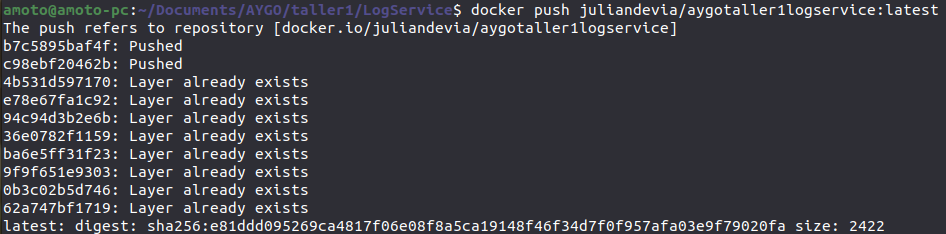
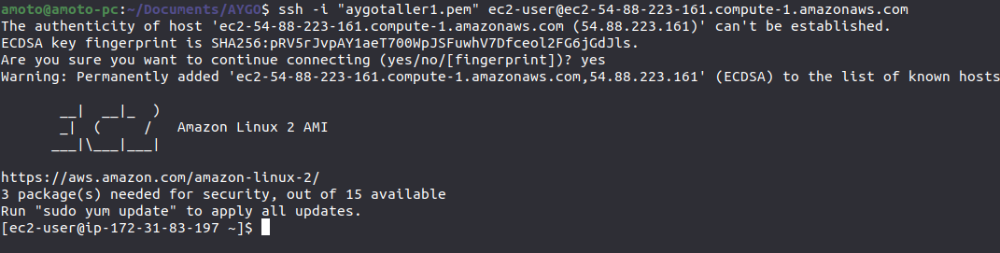

# Taller 1 AYGO

Por: Julian David Devia Serna.

## Requisitos

- Java 8

- Maven v3.6.3

- NodeJS v16.13.0

- NPM 8.1.0

- Docker

- Docker Compose

## Proyectos

En este taller se construyeron 3 proyectos que se ejecutan desde imagenes docker para su despliegue en la nube.

[Log Service](LogService/README.md)

[Load Balancer](LoadBalancer/README.md)

[Frontend](log_front/README.md)

## Configuración de Imagenes Docker en [DockerHub](https://hub.docker.com/)

- Acceder a [docker hub](https://hub.docker.com).

- Crear el repositorio.

- Construir imagen de docker del proyecto deseado. Por ejemplo para [Log Service](LogService/README.md) se crea la imagen `logservice`.

- Crear tag para la imagen de docker. Por ejemplo para [Log Service](LogService/README.md) se crea el tag usando imagen `logservice` para el repositorio `juliandevia/aygotaller1logservice` en el tag `latest`.

- Pushear el tag de la imagen al repositorio en docker hub. En nuestro ejemplo, se hace push del tag para el repo `juliandevia/aygotaller1logservice` con el tag `latest`.

## Despliegue en AWS

- Crear una instancia de EC2

- Abrir puertos 80 y 8090 en el security group de la instancia

- Acceder por medio de SSH

- Actualizar los paquetes del sistema operativo

- Instalar Docker

- Instalar docker-compose

- Copiar el archivo [`docker-compose.yml`](docker-compose.yml)

- Ejecutar el archivo docker-compose

- Acceder a el DNS público de la instancia para ver el frontend

- Almacenar un log esceribiendolo en el campo de texto y oprimiendo el botón

- Si se desea, se puede visualizar en los logs de [Load Balancer](LoadBalancer/README.md) que balancea los request que recibe en las 3 instancias de [Log Service](LogService/README.md) que el docker-compose levanta.

